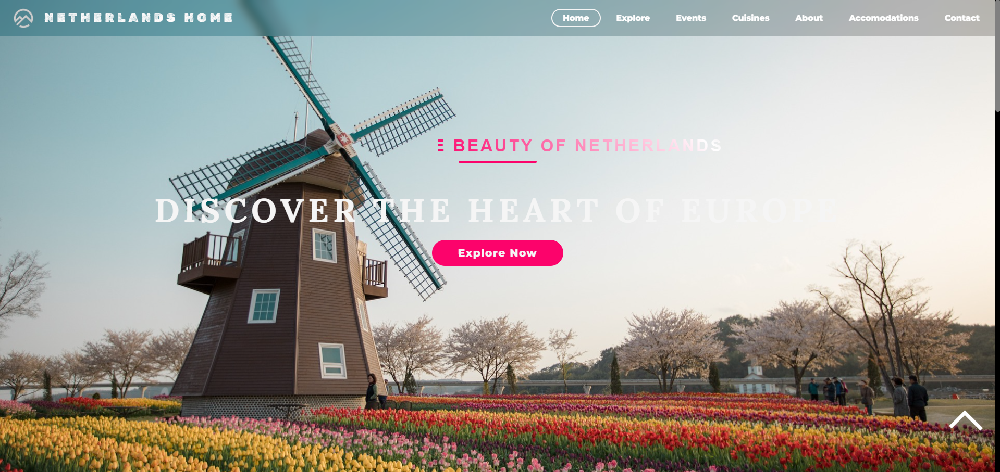
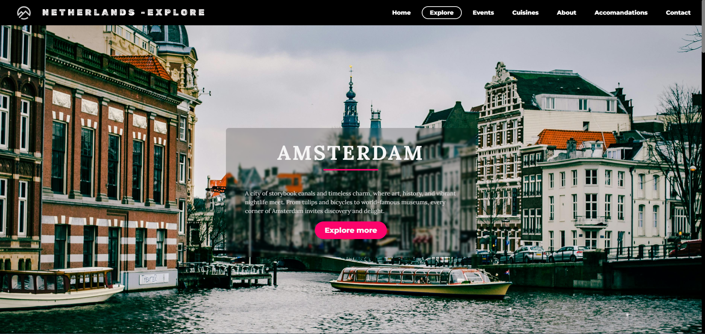
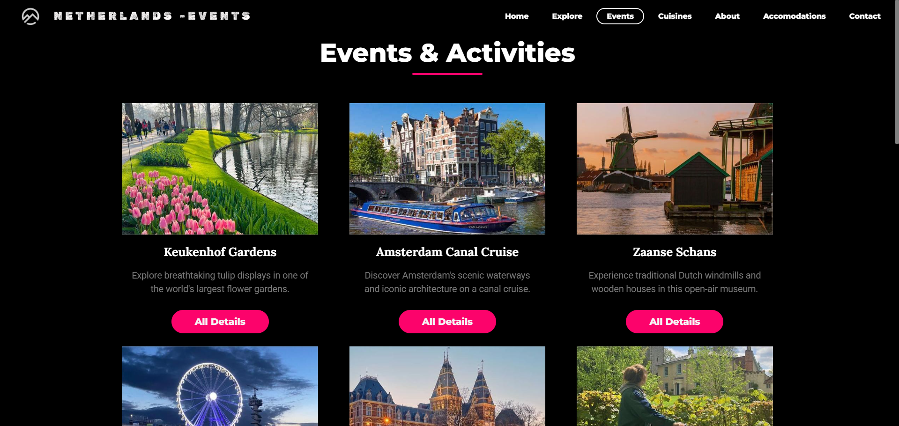

# 🇳🇱 Netherlands Travel Guide App 🌷✈️

Explore the beauty, culture, and history of the Netherlands with this interactive travel guide app! This project is designed for travel enthusiasts who want to discover famous Dutch destinations, local experiences, traditional cuisine, and travel tips through a clean and engaging user interface.

---

## ✨ Features

- 📍 Interactive guide to famous Dutch attractions
- 🏛️ Explore iconic cities like Amsterdam, Rotterdam, Utrecht, and The Hague
- 🖼️ Beautiful image galleries of tourist destinations
- 🍽️ Dutch food and cultural highlights
- 🚲 Travel experiences including canal tours, windmills, and museums
- 📅 Personalized travel itinerary planning
- 📱 Fully responsive and mobile-friendly design
- 🌍 Easy-to-use navigation and clean UI

---

## 🛠️ Tech Stack

### Frontend
- HTML5
- CSS3
- JavaScript

### Design Tools
- Figma
- Canva
- Adobe Illustrator

---

## 🖼️ Screenshots

### 🏠 Home Page


### 📍 Attractions Map


### 🚲 Travel Experiences


---

## 🚀 Getting Started

> Prerequisites:
> - A modern web browser

---

## 1️⃣ Clone the Repository

```bash
git clone https://github.com/yourusername/netherlands-travel-guide.git

cd netherlands-travel-guide
```

---

## 2️⃣ Run the Project

Open the `index.html` file in your browser:

```bash
open index.html
```

Or simply double-click the file manually.

---

## 📁 Project Structure

```bash
netherlands-travel-guide/
├── assets/
│   ├── home-page.png
│   ├── map-page.png
│   ├── food-page.png
│   └── experience-page.png
│
├── index.html
├── style.css
├── script.js
└── README.md
```

---

## 🌍 Top Destinations Included

- 🌷 Amsterdam
- 🌉 Rotterdam
- 🏰 Utrecht
- 🌊 The Hague
- 🚲 Giethoorn
- 🌾 Kinderdijk Windmills

---

## 🍽️ Dutch Specialties Featured

- 🧀 Dutch Cheese
- 🥞 Poffertjes
- 🍪 Stroopwafels
- 🐟 Haring
- 🍟 Dutch Fries

---

## ✨ Future Improvements

- 🌍 Multilingual Support
- 📱 Progressive Web App (PWA)
- 🧭 Real-time Navigation Assistance
- 💬 AI Travel Assistant Chatbot
- ☁️ Cloud-based itinerary saving
- 🗺️ Live weather integration

---

## 🤝 Contribution

Contributions are welcome!

1. Fork the repository
2. Create your feature branch:

```bash
git checkout -b feature/new-feature
```

3. Commit your changes:

```bash
git commit -m "Added new feature"
```

4. Push to GitHub:

```bash
git push origin feature/new-feature
```

5. Submit a Pull Request

---

## 📝 License

This project is licensed under the [MIT License](LICENSE).

---

## 👨‍💻 Author

Made with ❤️ by **Vishal V.**

Travel • Design • Web Development

---

## 🌟 Support

If you found this project helpful:

⭐ Star the repository  
🍴 Fork the project  
🛠️ Contribute to development  

---

<p align="center">
  Built with ❤️ for travel lovers around the world 🌍
</p>
